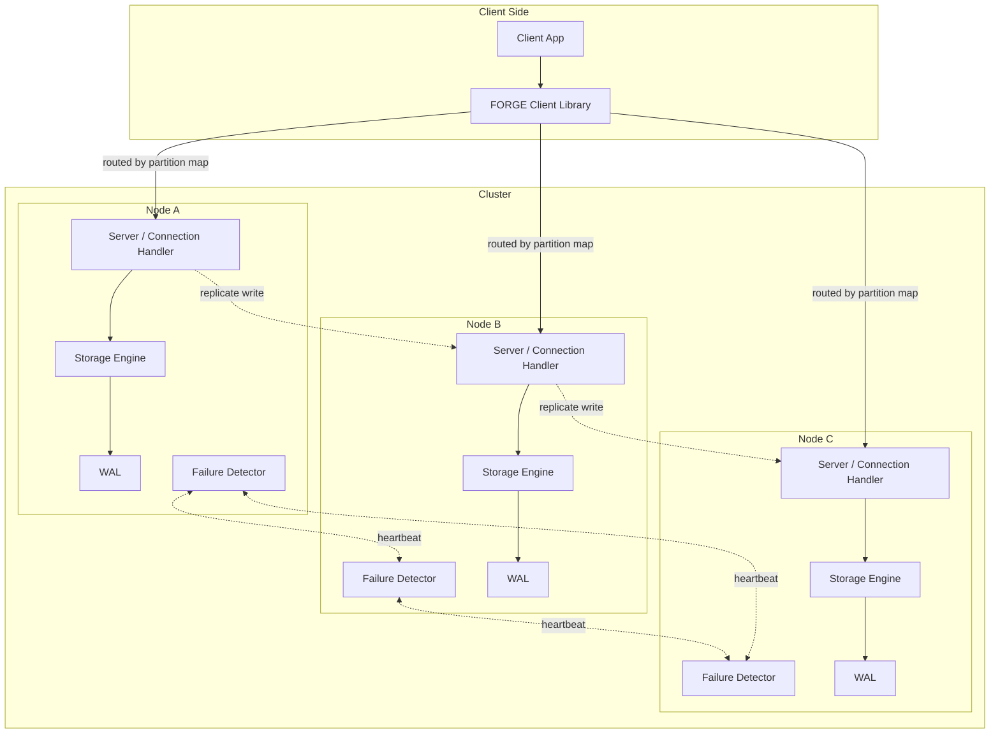

# FORGE — Architecture

## 1. What FORGE is

A distributed key-value store with:

- `GET` / `PUT` / `DELETE` over the network
- durable, crash-safe persistent storage (write-ahead log + on-disk data files)
- concurrent client handling
- data partitioned (sharded) across multiple nodes
- replication of each partition across multiple nodes
- failure detection between nodes
- automatic recovery of a node that crashes and rejoins
- a benchmarking harness that produces real throughput/latency numbers

It is built bottom-up: a correct, durable, concurrent **single node** first;
networking second; a **cluster** (partitioning, replication, failure handling)
last. Each layer is only added once the layer beneath it is tested and understood.

## 2. High-level shape



Each node is a full-featured single-node store on its own (storage engine + WAL +
network server). The cluster layer on top decides *which* node(s) own a given key
and *how many copies* of it exist.

## 3. Major components

### 3.1 Storage Engine (single node, durable)
- **MemTable** — an in-memory sorted map holding the most recent writes
  (`ConcurrentSkipListMap` or similar). Fast to read/write, lost on crash unless
  backed by the WAL.
- **Write-Ahead Log (WAL)** — every mutation (`PUT key value` / `DELETE key`) is
  appended to a log file **and fsynced** before the in-memory state is updated
  and before the client gets an ack. This is what makes writes durable across a
  crash: on restart, FORGE replays the WAL to rebuild the MemTable.
- **On-disk data files** — periodically, the MemTable is flushed to an immutable
  sorted file on disk (a simplified SSTable). This bounds memory usage and lets
  the WAL be truncated after a successful flush.
- **Compaction** (later phase) — merges multiple on-disk files, dropping
  overwritten/deleted keys, to bound disk usage and read amplification.

### 3.2 Storage API
The `GET` / `PUT` / `DELETE` contract that sits on top of the engine. Defines
what a read must return relative to a concurrent write (its consistency
contract *within one node*), and what durability a completed `PUT` guarantees
(has it been fsynced, or just applied in memory?).

### 3.3 Concurrency layer
Decides how multiple client threads touch the engine safely:
- reads should not block on unrelated writes
- writes to different keys should not serialize behind each other unnecessarily
- writes to the *same* key must not race
- WAL appends are naturally serialized (it's one file) — that serialization
  point is deliberately used as the source of a total write order per node.

### 3.4 Network layer
- A TCP server per node, listening for client connections.
- A small custom wire protocol (start text-based and easy to debug — think
  "PUT key value\n" / "+OK\n", Redis-RESP-style — before ever considering
  a binary format).
- A connection-handling model (thread-per-connection to start; revisit only if
  benchmarking shows it's the bottleneck — Java NIO/selectors are a possible
  later optimization, not a starting requirement).

### 3.5 Client library
A small Java library (and a CLI on top of it) that: opens a connection,
speaks the wire protocol, and — once partitioning exists — knows the partition
map so it can route a request to the right node without guessing.

### 3.6 Partitioning (sharding)
Splits the keyspace across nodes so no single node holds all the data.
- **Consistent hashing** with virtual nodes is the standard approach: it
  minimizes key movement when a node joins/leaves, versus plain
  `hash(key) % N`, which reshuffles almost everything when `N` changes.
- A **partition map** (which node owns which hash range) has to live
  somewhere every participant can see it — start with a simple
  every-node-has-a-copy, gossip-updated map before reaching for anything
  fancier (e.g. a separate coordination service).

### 3.7 Cluster membership & failure detection
Nodes need to know who else is alive.
- Simplest workable version: each node heartbeats its peers on an interval;
  if a peer misses N heartbeats in a row, it's marked suspect, then down.
- This directly trades off false positives (marking a slow-but-alive node
  dead) against detection speed (how long a truly dead node looks alive).
  That tradeoff is a core, explicit design decision, not an afterthought.

### 3.8 Replication
Each partition is stored on more than one node so data survives a node
failure.
- **Leader-follower per partition** is the chosen starting model (see
  DESIGN.md §4 for why, versus leaderless/Dynamo-style quorums): one node
  is the leader for a given partition and accepts writes; it replicates to
  followers; reads can be served by the leader (strongly consistent) or
  followers (may be stale, but spreads load).
- Consensus (Raft/Paxos-style automatic leader election) is treated as a
  **stretch phase**, not a prerequisite — full consensus is genuinely hard
  and FORGE starts with a simpler, explicit failover mechanism.

### 3.9 Recovery
- **Node crash + restart**: replay its own WAL, then catch up on any writes
  it missed from its replication leader.
- **Node crash + never comes back** (replaced by a new empty node): the new
  node needs a full data copy from a surviving replica before it's usable —
  this is "bootstrapping," and it's a distinct code path from WAL replay.

### 3.10 Benchmarking harness
A separate module that drives load (configurable read/write mix, key
distribution, concurrency level) against a running FORGE instance/cluster and
reports real, measured throughput and latency percentiles. No number goes into
BENCHMARKS.md that wasn't produced by actually running this harness.

### 3.11 Observability (cross-cutting)
Every component above exposes the metrics it's positioned to measure — the
storage engine reports storage overhead, the replicator reports replication
lag, the failure detector reports its own false-positive/detection-time
behavior, and so on. `forge-bench` is the aggregator/reporter, not the source,
of these numbers. Full metric definitions, how each is computed, and which
phase makes each one measurable for the first time live in
[DESIGN.md §3](DESIGN.md#3-observable-metrics) — this exists here only so the
component list above is honest that metrics aren't bolted on at the end.
See also `docs/OPERATIONS.md` for the Phase-14-era admin/inspection surface.

### 3.12 Consensus & automated failover (Phase 14)
A real Raft implementation (`forge-cluster`'s `consensus` package) —
terms, majority-vote leader election, AppendEntries log replication, and
the paper's Figure 8 commit-safety rule — used as the **control plane**
for deciding which node currently leads. Deliberately not a replacement
for §3.8's replication: Raft's own log carries nothing but a one-entry-per-
election marker, never real KV writes. See PROGRESS.md's Phase 14 section
for the original scope, and the "Post-Phase-15 engineering audit" section
for `currentTerm`/`votedFor` persistence added afterward (`RaftPersistentState`)
— the log itself remains deliberately unpersisted; see that section's
disclosed liveness consequence for a bare-minimum-quorum cluster.

### 3.13 Fenced data-plane leadership & automated failover (Phase 15)
Phase 14's consensus result is wired into §3.4/§3.8's live runtime via
`forge-cluster`'s `leadership` package:
- **`PartitionLeadership`** implements `WriteAuthority` (a small interface
  in `forge-server`, added so the dependency points the right direction —
  `forge-cluster` already depends on `forge-server`), backing
  `ForgeServer`'s new write-fencing gate with `RaftCluster.canServeAuthoritatively()`
  — not `isConfirmedLeader()` alone, which never notices a silently
  partitioned-away leader. See §5's leader-lease explanation below.
- **`SequenceEpochs`** gives each Raft term a disjoint band of WAL
  sequence numbers, making a failover-induced sequence collision (old
  leader's unreplicated tail vs. new leader's first writes) structurally
  impossible, with no change to the WAL/replication wire formats.
- **`ReplicationFollowerCoordinator`** keeps each node's
  `ReplicationFollower` pointed at whoever Raft currently designates
  leader, redirecting automatically on failover.
- **`StaleReplicaRecovery`** performs a full snapshot-based resync (Phase
  10's existing transfer mechanism) for the one case incremental catch-up
  can't safely cover: a rejoining node whose own prior data might be
  divergent.

**The leader-lease fencing mechanism, precisely**: `RaftNode` now tracks,
per peer, the timestamp of its most recent successful AppendEntries
acknowledgment in the current term. `hasRecentQuorumContact(within)`
answers "have I had real contact with a majority recently" — a leader
that won an election and is then partitioned away stops being able to
answer "yes" once `within` elapses, purely from its own clock, with no
message from anyone telling it so. This is the mechanism that closes the
"alive but stale, never told" gap named in PROGRESS.md's Phase 15 section
— see `docs/CONSISTENCY.md` §5 for the guarantee this provides and its
precise, bounded limits.

**What this does not do**: convert replication from asynchronous to
synchronous (deliberately unchanged — DESIGN.md §2), or extend fencing to
`GET` (deliberately unchanged — reads are answered locally on any node,
leader or not), or support more than one Raft group per node/partition
(single-partition scope this phase — see PROGRESS.md's Phase 15 known
limitations).

### 3.14 Multi-node launcher (post-Phase-15 audit)
`com.forge.cluster.launcher` (`ClusterConfig`/`NodeSpec`/`ClusterNode`/
`ClusterNodeMain`) is a real CLI that starts one full cluster node — every
component from §§3.1-3.13 wired together exactly as §3.13 describes —
from a plain-text, one-line-per-node config file, as a genuine standalone
process. `ClusterNode.start(...)` holds the actual wiring (directly
testable in-process, real ports, no subprocess needed); `ClusterNodeMain`
is a thin CLI shell around it. Closes the "no way to run an N-node cluster
except from tests" gap named throughout Phase 15's own documentation — see
PROGRESS.md's "Post-Phase-15 engineering audit" section and docs/DEMO.md
Step 13. Single-partition scope, matching §3.13 exactly; no
process-management of its own.

## 4. Repository structure

Maven multi-module (chosen for beginner-friendliness and ubiquitous IDE/tooling
support over Gradle — revisit later if it becomes limiting, but it won't for a
project this size):

```
forge/
├── pom.xml                      (parent/aggregator)
├── README.md
├── PROGRESS.md                  (phase-by-phase log: decisions, bugs found/fixed, tests)
├── docs/
│   ├── ARCHITECTURE.md          (this file)
│   ├── DESIGN.md                (roadmap, phase contracts, implementation constraints)
│   ├── BENCHMARKS.md            (real, measured results only — §1-§8)
│   ├── FAILURE_MODEL.md         (what FORGE assumes can fail, and how each phase responds)
│   ├── CONSISTENCY.md           (exactly what a GET/PUT does and doesn't guarantee)
│   ├── OPERATIONS.md            (how to inspect a running cluster's state)
│   ├── DEMO.md                  (a reproducible, real-commands-only walkthrough)
│   ├── INTERVIEW_GUIDE.md       (implementation-grounded Q&A)
│   └── RESUME.md                (resume bullets, sourced from what's actually built/measured)
├── tests/                       (cross-module integration/system tests)
├── forge-common/                (shared types, wire protocol messages,
│                                  serialization helpers — no logic of its own)
├── forge-storage/                (MemTable, WAL, SSTables, compaction, Bloom
│                                  filters, the GET/PUT/DELETE storage API)
├── forge-server/                 (TCP server, connection handling, wraps
│                                  forge-storage for a single node)
├── forge-client/                 (client library + CLI)
├── forge-cluster/                (consistent hashing/partitioning, membership
│                                  & failure detection, leader-follower
│                                  replication, snapshot recovery, chaos/fault
│                                  injection, Raft consensus)
└── forge-bench/                  (load generators + latency/throughput/
                                   amplification measurement, all results real)
```

Each module has its own `src/main/java` and `src/test/java` with unit tests
scoped to that module; `tests/` at the root is reserved for tests that need to
spin up multiple modules/processes together (e.g. a 3-node cluster test).

## 5. Non-goals (explicitly out of scope, at least initially)

- Not a SQL engine — no query language, no secondary indexes, no transactions
  across multiple keys.
- Not using an existing embedded/distributed DB, consensus library, or
  coordination service (RocksDB, LevelDB, etcd, ZooKeeper, Raft/Paxos
  libraries such as Atomix, Redis, Netty) as a stand-in for a core mechanism
  — every core mechanism (WAL, storage engine, hashing/partitioning, failure
  detection, replication, recovery) is implemented by us. The JDK standard
  library and JUnit for tests are the only "given" pieces. See
  [DESIGN.md §9](DESIGN.md#9-implementation-constraints) for the full,
  binding list.
- Not targeting multi-datacenter / WAN replication.
- Not implementing full Byzantine fault tolerance — the failure model is
  crash-stop (a node stops or is slow; it doesn't send malicious/corrupted
  data on purpose).
- **Update, Phase 14**: this non-goal originally deferred Raft/Paxos-style
  consensus until simpler failover was shown to need replacing. That plan
  was superseded by an explicit, later project directive to build real
  consensus regardless, as the capstone distributed-systems phase — Phase
  14 implements it (§3.12). Left here, struck through in spirit rather than
  deleted, so the roadmap's own history stays honest rather than quietly
  rewritten.
- No authentication, authorization, or transport encryption (TLS) —
  `ForgeServer` accepts any TCP connection and trusts every request. Adding
  either is ordinary, well-understood engineering, not a distributed-systems
  concept this project exists to explore; both are natural extensions if
  FORGE were ever exposed beyond a trusted local/demo environment.
